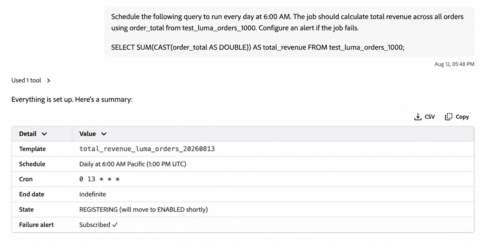

# Preparazione dei dati SQL in Collaboratore

Utilizzare Preparazione dati SQL in Collaboratore per eseguire le attività comuni di [Data Distiller](https://experienceleague.adobe.com/it/docs/experience-platform/query/data-distiller/overview) con prompt in linguaggio naturale. È possibile generare SQL, risolvere problemi o ottimizzare una query esistente, visualizzare in anteprima i risultati e pianificare le query per l&#39;esecuzione ricorrente.

>[!AVAILABILITY]
>
>La preparazione dei dati SQL in Collaboratore è disponibile in Disponibilità limitata.

## Prerequisiti {#prerequisites}

Prima di utilizzare Preparazione dati SQL in Collaboratore, verificare di disporre dei seguenti elementi:

- Adesione a Data Distiller.
- Accesso a Collaboratore.

## Introduzione {#get-started}

Per iniziare, aprire Collaboratore e immettere una richiesta in linguaggio naturale che descriva l&#39;attività o il risultato SQL che si desidera ottenere.

Puoi identificare i set di dati che desideri utilizzare nella richiesta. Se sono necessarie ulteriori informazioni per completare l&#39;attività, Collaboratore può porre domande di follow-up prima di continuare.

Dopo la generazione o l&#39;aggiornamento dell&#39;istruzione SQL, è possibile continuare la conversazione per visualizzare in anteprima i risultati, perfezionare la query, salvarla o pianificarla per l&#39;esecuzione ricorrente.

Per istruzioni sull&#39;utilizzo dell&#39;interfaccia di Coworker, consulta la [Guida dell&#39;interfaccia utente di Coworker](https://experienceleague.adobe.com/it/docs/coworker/content/chat/ui-guide).

## Funzionalità supportate {#supported-capabilities}

È possibile utilizzare Preparazione dati SQL per le attività seguenti:

| Funzionalità | Descrizione |
| --- | --- |
| **Authoring SQL** | Genera SQL da una descrizione in linguaggio naturale dell&#39;operazione dati che si desidera eseguire. |
| **Ottimizzazione SQL** | Analizza una query esistente di Data Distiller e ottimizzala per le prestazioni, mantenendo al contempo i risultati previsti. |
| **Diagnosi e correzione degli errori SQL** | Diagnosticare gli errori in una query SQL esistente, spiegare la causa principale e generare le istruzioni SQL corrette. |
| **Pianificazione query e avvisi** | Salva e pianifica le query per l’esecuzione ricorrente e configura gli avvisi di query supportati. |

## Utilizzare la preparazione dei dati SQL in una conversazione {#work-with-sql-data-preparation}

È possibile combinare le funzionalità di preparazione dei dati SQL nella stessa conversazione con il collaboratore, anziché trattarle come flussi di lavoro separati.

Sarà possibile, ad esempio:

1. Descrivere il risultato desiderato e generare SQL.
2. Visualizzare in anteprima fino a cinque righe di risultati di query.
3. Affinare la query o porre domande sull&#39;istruzione SQL generata.
4. Salva la query.
5. Pianifica la query per l’esecuzione ricorrente e configura gli avvisi.

Il collaboratore può porre domande di follow-up quando sono necessarie informazioni aggiuntive, ad esempio per identificare il set di dati appropriato o confermare il fuso orario per una pianificazione.

L’anteprima di una query restituisce fino a cinque righe. Per eseguire e utilizzare le query direttamente in Experience Platform, consulta la [Guida dell&#39;interfaccia utente di Query Editor](https://experienceleague.adobe.com/it/docs/experience-platform/query/ui/user-guide).


### Genera SQL dal linguaggio naturale {#generate-sql}

Utilizzare l&#39;authoring SQL quando si conosce il risultato o la trasformazione che si desidera ottenere, ma si desidera che venga generato il codice SQL corrispondente.

Per generare codice SQL dai dati corretti, è possibile identificare e convalidare i set di dati interessati. Se la richiesta non fornisce informazioni sufficienti per identificare il set di dati appropriato, Collaboratore può porre domande di follow-up prima di continuare.

Ad esempio:

> Salve! Utilizzando test_luma_web_events_1000, riepiloga il coinvolgimento del cliente per tipo di evento. Mostra il tipo di evento, gli eventi totali e i clienti univoci. Restituisci una riga per tipo di evento e ordina i risultati in base ai clienti univoci dal valore più alto a quello più basso.

Collaboratore restituisce l’SQL generato e può eseguire la query per fornire un’anteprima dei risultati.


Per informazioni sulla creazione e l&#39;esecuzione di query direttamente in Experience Platform, vedere la [Guida dell&#39;interfaccia utente di Query Editor](https://experienceleague.adobe.com/it/docs/experience-platform/query/ui/user-guide).

### Ottimizza SQL esistente {#optimize-sql}

Utilizzare l&#39;ottimizzazione SQL quando si dispone già di una query di Data Distiller e si desidera migliorarne le prestazioni senza modificare i risultati previsti.

È possibile chiedere al Collaboratore di spiegare le modifiche, confrontare il linguaggio SQL originale e quello ottimizzato e fornire informazioni di convalida o di piano di query.

Ad esempio:

> Ottimizza la seguente query per le prestazioni di Data Distiller mantenendo esattamente gli stessi risultati. Spiega cosa hai modificato e perché la query ottimizzata è logicamente equivalente.
>
> ```sql
> SELECT
>         p.customer_id,
>         p.first_name,
>         p.last_name,
>         p.loyalty_status,
>         COUNT(o.order_id) AS total_orders,
>         SUM(CAST(o.order_total AS DOUBLE)) AS total_revenue
> FROM test_luma_profiles_1000 p
> INNER JOIN test_luma_orders_1000 o
>         ON p.customer_id = o.customer_id
> GROUP BY
>         p.customer_id,
>         p.first_name,
>         p.last_name,
>         p.loyalty_status
> ORDER BY total_revenue DESC;
> ```
>
> Inviami la risposta completa, in particolare l’istruzione SQL originale, l’istruzione SQL ottimizzata, la spiegazione dell’equivalenza ed eventuali risultati EXPLAIN/validation.

Se la query fornita è già ottimizzata, Collaboratore può determinare che non è necessaria alcuna modifica e spiegarne la valutazione.


SQL generato tramite la funzionalità di authoring SQL è già ottimizzato. Non è necessario inviare separatamente le istruzioni SQL appena generate per l&#39;ottimizzazione.

Per la sintassi SQL e i comandi supportati, vedere il riferimento SQL [Query Service](https://experienceleague.adobe.com/it/docs/experience-platform/query/sql/overview).

### Diagnosticare e correggere gli errori SQL {#diagnose-sql-errors}

Utilizzare la diagnosi degli errori SQL quando una query esistente non riesce ed è necessario fornire assistenza per identificare la causa e correggere l&#39;istruzione SQL.

Collaboratore analizza la query, identifica la causa dell’errore, spiega il problema e fornisce istruzioni SQL corrette.

Ad esempio:

> Salve! La query seguente non riesce. Diagnosticare l’errore, spiegare la causa principale e fornire una query corretta:
>
> ```sql
> SELECT
>         o.order_id,
>         o.product_id,
>         p.product_name,
>         o.order_total
> FROM test_luma_orders_1000 o
> JOIN test_luma_product_catalog_1000 p
>         ON o.productid = p.productid;
> ```
>
> La query corretta deve utilizzare i campi ID prodotto appropriati di entrambi i set di dati.

Dopo aver corretto la query, puoi chiedere a Collaboratore di eseguirla e visualizzare in anteprima i risultati.


### Pianificare le query e configurare gli avvisi {#schedule-queries}

Dopo aver generato, corretto o visualizzato in anteprima una query, puoi continuare la conversazione per salvarla e pianificarla per l’esecuzione ricorrente.

Ad esempio:

> Pianifica l’esecuzione di questa query ogni giorno alle 06:00. Configura un avviso se la query non riesce.

Se le informazioni richieste sono mancanti o ambigue, Collaboratore pone domande di follow-up prima di creare la pianificazione. Ad esempio, può chiedere di confermare il fuso orario associato a un orario di esecuzione richiesto.

Dopo aver confermato i dettagli di pianificazione richiesti, Collaboratore restituisce un riepilogo del modello di query salvato, della pianificazione, del fuso orario, dello stato e dell&#39;avviso di errore.



Per informazioni dettagliate sulle pianificazioni delle query, le impostazioni di ricorrenza, i set di dati di output e gli avvisi, vedere [Pianificazioni query](https://experienceleague.adobe.com/it/docs/experience-platform/query/ui/query-schedules).

## Passaggi successivi {#next-steps}

Per ulteriori informazioni sulle funzionalità di Data Distiller e Query Service utilizzate da SQL Data Preparation, vedere la documentazione seguente:

- [Panoramica di Data Distiller](https://experienceleague.adobe.com/it/docs/experience-platform/query/data-distiller/overview)
- [Guida dell’interfaccia utente di Query Editor](https://experienceleague.adobe.com/it/docs/experience-platform/query/ui/user-guide)
- [Pianificazioni query](https://experienceleague.adobe.com/it/docs/experience-platform/query/ui/query-schedules)
- [Riferimento SQL di Query Service](https://experienceleague.adobe.com/it/docs/experience-platform/query/sql/overview)
