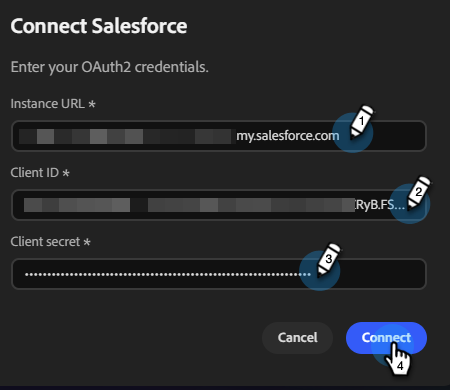

# Connetti a Salesforce {#salesforce}

Campagne Adobe Collaborator consente di collegare il tuo account Salesforce per accedere ai lead e ai contatti.

>[!PREREQUISITES]
>
>Per utilizzare questo connettore, è necessario disporre innanzitutto di:
>
>* Un account Salesforce attivo
>* Le seguenti autorizzazioni in Salesforce: `api`, `sobjects.Contact.read`, `sobjects.Campaign.read`, `sobjects.CampaignMember.read`
>* L&#39;URL dell&#39;istanza di Salesforce, [l&#39;ID client e il segreto client](https://help.salesforce.com/s/articleView?id=xcloud.remoteaccess_oauth_client_credentials_flow.htm&type=5#:~:text=DESCRIPTION-,client_id,-The%20consumer%20key) sono utili

## Come collegarsi

1. Nella home page di [Campagne collaboratori](https://coworker-campaigns.experience.adobe.com/), fare clic su **Personalizza** e selezionare **Connettori**.

   

1. Fare clic su **Aggiungi integrazione**.

   

   >[!NOTE]
   >
   >Se questa non è la prima integrazione, il pulsante indicherà &quot;Aggiungi connettore&quot;.

1. Nella riga Salesforce, fai clic su **Connetti**.

   

1. Immetti l&#39;**URL istanza**, l&#39;**ID client** e il **Segreto client** di Salesforce. Fai clic su **Connetti**.

   >[!NOTE]
   >
   >* In Salesforce, ID client = Chiave consumer e Segreto client = Segreto consumer.
   >
   >* Mentre ti trovi nell&#39;account Salesforce, puoi trovare l&#39;URL dell&#39;istanza nella barra degli indirizzi del browser oppure accedendo a **Configurazione** > **Impostazioni società** > **Dominio personale**.

   

Dopo la connessione, Salesforce viene visualizzato nell&#39;elenco Connettori e può essere selezionato quando si collega un elenco di lead o contatti da sincronizzare da Salesforce.

**Per disconnettersi:**

1. Nella schermata Connettori, individua il riquadro Salesforce e fai clic su **Gestisci**.

   

1. Fai clic su **Disconnetti** (al momento non è necessario immettere nuovamente il segreto client).

   

1. Fai di nuovo clic su **Disconnetti** per confermare.

   
