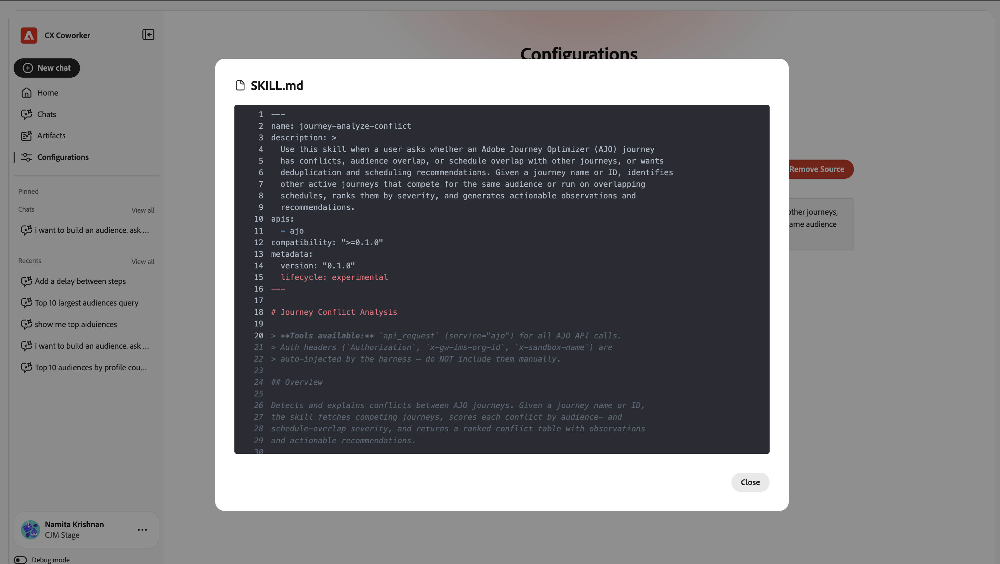
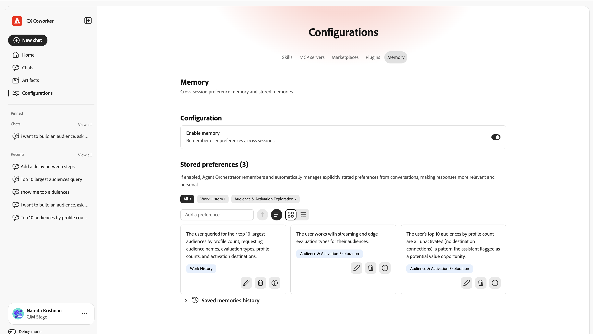

# Guida all’interfaccia utente {#ui-guide}

Diventa orientato con l’interfaccia di Chat con i collaboratori. Questa guida tratta tutte le operazioni, dall’accesso all’app, alla navigazione nell’area di lavoro, fino al massimo dalle conversazioni, alla gestione della cronologia e alla personalizzazione della configurazione.

>[!VIDEO](https://video.tv.adobe.com/v/3498558?learn=on)

## Accedere a Chat con i collaboratori

Accedi alla chat di Coworker passando a [https://experience.adobe.com/#/coworker](https://experience.adobe.com/#/coworker) e accedendo con le credenziali di Adobe.

È inoltre possibile accedervi selezionando **Collaboratore** dal selettore delle applicazioni nell&#39;intestazione superiore di CX Enterprise.

## Scegli la tua organizzazione e sandbox

Il contesto corrente viene visualizzato nella parte inferiore della barra di navigazione a sinistra, sotto il nome e l’immagine del profilo. Il contesto determina quali dati, abilità e strumenti connessi può raggiungere una conversazione, quindi confermarlo prima di iniziare.

Selezionare il proprio nome per aprire il menu dell&#39;account, in cui è possibile cambiare contesto e modificare le impostazioni dell&#39;area di lavoro:

| Elemento di interfaccia | Descrizione |
| --- | --- |
| Tema | Sposta il tema dell’interfaccia tra chiaro e scuro. |
| Impostazioni | Apri le impostazioni dell’area di lavoro per visualizzare i dettagli del tuo account e altre impostazioni. |
| Selettore organizzazione | Cambiare l’organizzazione IMS su cui opera Collaboratore. |
| Selettore sandbox | Cambia la sandbox di AEP attiva. |
| Applicazioni CX | Passare a un&#39;altra applicazione CX Enterprise connessa al proprio account. |
| Esci | Esci dal tuo account Adobe. |

## Navigare nell’interfaccia

L&#39;interfaccia di CX Collaborator ha due aree principali: la barra di navigazione a sinistra e l&#39;area di conversazione che riempie il resto della finestra.

## Barra di navigazione

La barra consente di accedere a ogni parte del prodotto e alle tue attività recenti.

| Elemento di interfaccia | Descrizione |
| --- | --- |
| Nuova chat | Inizia una nuova conversazione. La chat corrente viene salvata nella cronologia. |
| Home | Tornate al messaggio di saluto, alla casella di input e alle richieste suggerite. |
| Chat | Apri la cronologia completa della chat per cercare, fissare, archiviare o eliminare le conversazioni. |
| Configurazioni | Gestisci competenze, server MCP, Marketplace, plug-in e memoria. |
| Fissati | Conversazioni che hai interpretato, tenute in cima per un accesso rapido. Seleziona Visualizza tutto per visualizzarli nella pagina Chat. |
| Recenti | Le conversazioni più recenti. Seleziona Visualizza tutto per aprire la pagina Chat. |

## La schermata iniziale

La schermata iniziale è il punto da cui si inizia. Mostra un saluto personalizzato, la casella di input e una serie di prompt suggeriti tratti da cosa può aiutarti a fare la chat con Coworker nella tua sandbox.

### Suggerimenti

In Suggested for you (Suggerito per te), CX Collaborator elenca alcune attività di esempio. Seleziona un suggerimento per caricarlo nella casella di input, quindi modificalo prima di inviarlo o inviarlo così com’è. I suggerimenti sono un modo rapido per vedere i tipi di lavoro supportati da Chat di Coworker: spostare gli schemi tra sandbox, trovare anomalie in un percorso, convalidare un set di dati e altro ancora.

### Menzioni entità

I prompt suggeriti e i messaggi personalizzati possono fare riferimento a oggetti specifici nella sandbox utilizzando menzioni di entità come +[schema], +[percorso] e +[set di dati]. Un riferimento a un&#39;entità indica a Chat di Coworker esattamente quale oggetto intendi, quindi puoi aggiungere le tue menzioni digitando **+**.

## Casella di input della chat

La casella di input (etichettata &quot;Chiedi qualsiasi cosa al collega&quot;) è quella in cui si digita. Sotto il campo di testo è presente una barra degli strumenti per gli allegati, il comportamento di risposta, l&#39;input vocale e l&#39;invio.

| Elemento di interfaccia | Descrizione |
| --- | --- |
| + (Allega) | Apri il menu Allega per aggiungere un file o un oggetto dati al messaggio. |
| Modalità piano | Chiedi a Chat collaboratore di proporre un piano dettagliato e di mettere in pausa la tua approvazione prima che agisca. Disattivala per consentire a Chat di Coworker di agire direttamente. |
| Vista trascrizione | Controlla la quantità di attività interna di Chat con collaboratori visualizzata: Normale, Attiva o Dettagliata. |
| Microfono | Dettare il messaggio con input vocale. Selezionare di nuovo per interrompere la registrazione. |
| Invia | Invia il messaggio. Mentre Chat collaboratore risponde, questo diventa un controllo Stop che puoi utilizzare per interrompere. |

### Allega file e dati

Seleziona + per allegare il contesto al messaggio:

- Allega file: carica un file che Chat collaboratore può leggere e usare come riferimento nella risposta.
- Aggiungi dati o oggetto: fai riferimento a un oggetto della sandbox, ad esempio un set di dati o uno schema, in modo che Chat collaborativa funzioni sui dati live.

### Modalità piano

Attivare la modalità Piano quando un&#39;attività è complessa o modifica dati e si desidera rivedere prima l&#39;approccio. Chat collaboratore risponde con un piano e attende la tua approvazione prima di eseguirlo. Quando la modalità Pianificazione è disattivata, Chat con collaboratori procede direttamente al lavoro.

### Vista trascrizione

La vista Trascrizione imposta la quantità di ragionamento e di attività degli strumenti di Chat collaboratrice che appare in linea nella conversazione:

| Elemento di interfaccia | Descrizione |
| --- | --- |
| Normale | Una visione equilibrata: vengono riepilogati i passaggi di pensiero chiave e l’attività degli strumenti. |
| Focus | Una vista semplificata che nasconde la maggior parte dei passaggi intermedi in modo da visualizzare principalmente la risposta. |
| Dettagliata | Dettagli completi: ogni passaggio di pensiero, carico di abilità, lettura di file e query. |

## Utilizzare le risposte

Quando si invia un messaggio, Chat collaboratore esegue l&#39;operazione all&#39;aperto e restituisce la risposta. Una risposta può includere ragionamento, una registrazione degli strumenti utilizzati e uno o più artefatti.

### Pensiero e attività

Mentre funziona, Chat con collaboratori mostra ciò che sta facendo in modo da poter seguire (e verificare) il suo processo:

- Blocchi di pensiero: passaggi comprimibili etichettati &quot;Pensato per&quot; seguiti dal numero di secondi (o millisecondi). Espandi uno per leggere il ragionamento di Chat collaboratrice.
- Attività abilità: voci come Loaded skill mostrano la funzionalità specializzata introdotta da Chat collaboratore per l’attività.
- Attività di file e query: voci come Read file e Ran 1 query registrano i file letti da Chat di Coworker e le query eseguite, ciascuno con il tempo necessario.

>[!TIP]
>
>Utilizza la vista Trascrizione dettagliata per visualizzare ogni passaggio oppure Attiva per nasconderli.

### Artefatti

I risultati prodotti da Chat collaboratore (come una tabella di tipi di pubblico) vengono visualizzati come schede di artefatti all’interno della risposta. Da una scheda artefatto è possibile scaricare gli artefatti di tabella come file CSV. Quando una risposta include diversi artefatti, utilizza i controlli del carosello (Precedente/Successivo e il conteggio, ad esempio 1/1) per spostarsi tra di essi.

### Leggi l’analisi

Al di sotto degli artefatti, Chat con collaboratori riassume il significato dei risultati, evidenziando i risultati rilevanti e suggerendo azioni di follow-up da intraprendere successivamente.

### Invia feedback e copia le risposte

Ogni risposta dispone di controlli per valutarla e riutilizzarla:

- Miniature in alto / Miniature in basso: valuta la risposta per migliorare le risposte future.
- Copia: copia la risposta utilizzando Copia come Markdown (mantiene la formattazione) o Copia come testo normale.

## Gestire le chat

Seleziona Chat nella barra di navigazione per aprire la cronologia completa. Le conversazioni sono raggruppate per data e ogni riga mostra il titolo della chat e quanti giri contiene.

| Elemento di interfaccia | Descrizione |
| --- | --- |
| Ricerca per titolo | Trovare una conversazione precedente per nome. |
| Mostra fissate | Mostra solo le conversazioni che hai interpretato. |
| Mostra archiviate | Mostra le conversazioni archiviate. |
| Nuova chat | Inizia una nuova conversazione. |
| Menu Riga (...) | Su qualsiasi conversazione, stella (pin), rinomina, archivia o elimina la conversazione. |

## Configurazioni

Configurazioni è il luogo in cui puoi personalizzare ciò che Cloud Chat può fare. Dispone di cinque schede: Abilità, server MCP, Marketplace, Plug-in e Memoria.

### Competenza

Le abilità sono funzionalità specializzate che la chat di Coworker richiama automaticamente quando sono rilevanti, o che puoi attivare digitando / nella chat. La scheda Abilità elenca tutte le abilità installate e consente di aggiungerne altre.

- Aggiungi Source: installa le abilità da una nuova origine.
- Ricerca: trova un’abilità per nome.
- Cambia visualizzazione: consente di passare da un layout griglia a un layout elenco e viceversa.

Seleziona un’abilità per visualizzarne i dettagli: il plug-in a cui appartiene, una descrizione di quando viene utilizzata da Chat con i collaboratori e tutti i file inclusi. Seleziona Visualizza SKILL.md per leggere la definizione completa dell’abilità o Rimuovi Source per disinstallarla.

### Server MCP

I server MCP (Model Context Protocol) collegano Chat con collaboratori a strumenti e servizi esterni, come Adobe Journey Optimizer, Real-Time CDP, Target e Workfront. Nella scheda Server MCP sono elencate tutte le connessioni correnti e il numero di connessioni attive.

- Aggiungi server: connetti un nuovo strumento o servizio esterno.

Ogni scheda mostra il nome del server, il relativo endpoint e tutti i tag che descrivono ciò che fornisce.

### Marketplace

I Marketplace sono registri di plug-in da cui è possibile sfogliare e installare. La scheda Marketplace consente di aggiungere registri e di filtrarli per gruppo.

- Aggiungi marketplace: registra un nuovo marketplace plugin.
- Ricerca / Filtra per gruppo: restringi l’elenco per trovare un marketplace.

Ogni marketplace mostra la propria origine e uno stato Pronto una volta disponibile per l’installazione da.

### Plug-in

I plug-in estendono Chat con i collaboratori con competenze in bundle e server MCP che vengono installati e gestiti insieme come un&#39;unità. La scheda Plug-in mostra gli elementi installati e consente di aggiungerne altri dai marketplace.

- Browse Marketplace: trova nuovi plug-in da installare.
- Disinstalla: rimuovi un plug-in installato e tutti gli elementi inclusi nel bundle.
- Filtra per marketplace: individua i plug-in provenienti da ciascun registro.

### Memoria

La memoria consente a Chat collaboratore di ricordare le tue preferenze tra le conversazioni in modo che le sue risposte rimangano pertinenti e personali nel tempo.

- Abilita memoria: attiva o disattiva la memoria tra sessioni.
- Preferenze memorizzate: le preferenze Chat con il collaboratore sono state apprese e salvate. Ogni voce può essere modificata, eliminata o ispezionata e le voci possono essere filtrate per categoria.
- Memorie salvate cronologia: una sequenza temporale di modifiche apportate alle memorie memorizzate.

