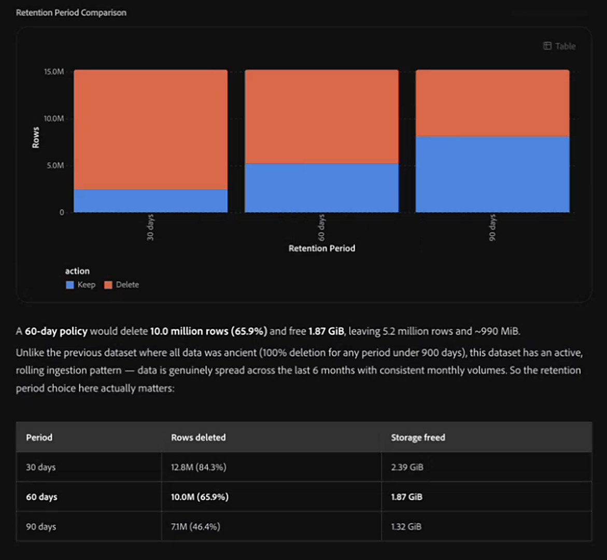

# Gestire la conservazione del data lake

Utilizza CX Coworker per comprendere il valore dei dati Experience Event nella sandbox e identificare i dati che possono beneficiare dell’ottimizzazione. Puoi iniziare con un’ampia richiesta, ad esempio chiedere a Collaboratore di ottimizzare i dati sandbox o di pulire i set di dati. Co-worker utilizza Data Management Agent per creare set di dati che meritano di essere esaminati, analizzare il modo in cui viene utilizzato un set di dati, modellare l’impatto di un periodo di conservazione e, quando appropriato, aiutare a gestire i criteri di conservazione del data lake.

## Prima di iniziare {#before-you-begin}

Assicurati di lavorare nella sandbox che contiene i set di dati da rivedere. È inoltre necessario accedere a Data Management Agent e alle autorizzazioni Adobe Experience Platform richieste. Consulta [Prerequisiti per Data Management Agent](../../../../agents/data-management.md#prerequisites).

## Ottimizzare i dati nella sandbox {#optimize-data-in-your-sandbox}

Utilizza queste abilità insieme come flusso di lavoro. Inizia con un obiettivo di gestione dei dati ampio, ad esempio comprendere il valore dei dati o ottimizzarli nella sandbox. Collaboratore consente di individuare i set di dati che è opportuno esaminare, controllare in che modo viene utilizzato attivamente un set di dati, modellare l’impatto di un potenziale periodo di conservazione e quindi impostare, modificare o rimuovere un criterio di conservazione quando si è pronti ad agire.

### Trovare dati che meritano di essere ottimizzati {#find-data-worth-optimizing}

Per decidere da dove iniziare, chiedi a Collaboratore di identificare i set di dati di Experience Event che meritano di essere esaminati. Puoi iniziare in maniera generale chiedendo qual è il valore dei dati, dell’ottimizzazione dei dati o della pulizia dei set di dati. Utilizza l’abilità Elenca set di dati per rivedere le dimensioni di archiviazione, il conteggio delle righe, lo stato di conservazione esistente e l’abilitazione del profilo. Per limitare l’elenco, puoi filtrare i risultati in base a criteri quali le dimensioni del set di dati, il conteggio delle righe o l’accesso recente. L&#39;abilità è di sola lettura. Collaboratore restituisce una tabella che puoi scansionare e confrontare, insieme a visualizzazioni che evidenziano i set di dati per dimensione, conteggio delle righe e età dei dati.

Dopo aver ristretto l’elenco, utilizza l’abilità di utilizzo Analisi set di dati per scoprire in che modo viene utilizzato attivamente un set di dati specifico.

Non tutti i set di dati inutilizzati o abbandonati emersi da questa abilità sono un buon candidato per i criteri di conservazione dei data lake. Se devi rimuovere un intero set di dati o gestire dati in un altro archivio Experience Platform, consulta [Scegliere la funzionalità di gestione del ciclo di vita dei dati corretta](https://experienceleague.adobe.com/en/docs/experience-platform/data-lifecycle/choose-a-capability). Prima di impostare i criteri di conservazione di un data lake, verifica che il set di dati sia un set di dati Experience Event.

Esempio di prompt:

- &quot;Ho la sensazione che i miei dati possano essere ottimizzati.&quot;
- &quot;Aiutami a comprendere il valore dei miei dati.&quot;
- &quot;Ottimizza i dati della sandbox.&quot;
- &quot;Pulisci i set di dati della sandbox&quot;
- &quot;Mostrami i set di dati dell’evento più grandi&quot;
- &quot;Mostra set di dati di dimensioni superiori a 100 GB privi di set di conservazione del data lake&quot;.
- &quot;Devo rimuovere circa 2 TB di dati. Da dove inizio?&quot;
- &quot;Potete aiutarmi a trovare dati orfani, abbandonati o inutilizzati?&quot;
- &quot;Dai la priorità ai set di dati a cui non è stato effettuato l’accesso negli ultimi 90 giorni.&quot;

### Controllare l’utilizzo attivo di un set di dati {#check-how-actively-a-dataset-is-used}

Prima di decidere se un set di dati è adatto a un criterio di conservazione di un data lake, scopri in che modo viene utilizzato attivamente il set di dati. Utilizza l’abilità Analizza utilizzo set di dati per valutare un set di dati specifico tra più segnali di utilizzo. Questi segnali includono l’attività di acquisizione recente, l’attività di query, la stabilità dello schema e se il set di dati alimenta altre applicazioni Adobe Experience Platform. L&#39;abilità è di sola lettura. Coworker restituisce un livello di utilizzo complessivo, un raggruppamento dei segnali e un riepilogo in linguaggio semplice di ciò che indicano sul set di dati.

<!-- TODO: Confirm the final usage-tier thresholds with engineering after the planned update from a 7-day to a 30-day analysis window is complete. Update this section with the final definitions before publishing. -->

>[!NOTE]
>
>Le metriche mostrate hanno lo scopo di fornire segnali utili e potrebbero non rappresentare tutti i fattori rilevanti per la decisione. Prima di agire, è consigliabile rivedere i dettagli disponibili e applicare il contesto aziendale.

Esempio di prompt:

- &quot;Quanto attivamente viene utilizzato il set di dati degli eventi web?&quot;

### Modellare l&#39;impatto di un periodo di conservazione {#model-the-impact-of-a-retention-period}

Prima di impegnarsi in un periodo di conservazione specifico, scopri la quantità di dati da conservare o rimuovere. Utilizza l’abilità di conservazione di Analyze dataset per rivedere le metriche di archiviazione di un set di dati e la distribuzione per età dei relativi dati. Utilizza quindi tale distribuzione per modellare la quantità di dati che un periodo di conservazione proposto manterrebbe o rimuoverebbe. Il collaboratore mostra l’impatto stimato in base al conteggio delle righe e alle dimensioni di archiviazione.

L&#39;abilità è di sola lettura. Collaboratore restituisce l’età dei dati e l’analisi dell’impatto direttamente nella conversazione, in modo da poter confrontare i risultati con le impostazioni di conservazione correnti del set di dati prima di decidere se modificarli.

Esempio di prompt:

- &quot;Quale sarebbe l’impatto se impostassi un periodo di conservazione di 60 giorni su questo set di dati?&quot;

### Impostare, modificare o rimuovere un criterio di conservazione {#set-change-or-remove-a-retention-policy}

>[!IMPORTANT]
>
>Il periodo minimo di conservazione del data lake è di 30 giorni. I periodi più brevi non sono supportati.

Dopo aver deciso un periodo di conservazione, utilizza l’abilità Gestisci conservazione dei set di dati per impostare, modificare o rimuovere un criterio di conservazione del data lake su un set di dati. L’abilità mostra l’impatto proposto prima di applicare qualsiasi modifica. Il criterio viene applicato solo dopo l’approvazione esplicita della richiesta. La descrizione della modifica desiderata non la applica.

Dopo aver confermato un criterio di conservazione, la visualizzazione della modifica nell’interfaccia utente di Adobe Experience Platform potrebbe richiedere alcuni minuti. I criteri di conservazione non eliminano immediatamente i dati scaduti. Il processo di conservazione iniziale inizia entro 24 ore dall&#39;applicazione del criterio. Dopo l’esecuzione iniziale, un processo pianificato valuta ed elimina i record scaduti ogni 30 giorni. Per ulteriori informazioni su conservazione ed eliminazione, consulta la [guida alla conservazione dei set di dati di Experience Event (TTL)](https://experienceleague.adobe.com/en/docs/experience-platform/catalog/datasets/experience-event-dataset-retention-ttl-guide).

Ogni modifica ai criteri di conservazione viene registrata in un audit trail, anche quando un criterio viene impostato, modificato o rimosso. L’audit trail registra chi ha apportato ogni modifica, quando si è verificata e cosa è stato modificato. Puoi seguire il collegamento fornito da Collaboratore per esaminare questi eventi nella scheda Registro di controllo del set di dati in Adobe Experience Platform. Per ulteriori informazioni, vedere [Panoramica dei registri di controllo](https://experienceleague.adobe.com/it/docs/experience-platform/landing/governance-privacy-security/audit-logs/overview).

Esempio di prompt:

- &quot;Imposta il periodo di conservazione su 60 giorni per questo set di dati.&quot;
- &quot;Rimuovi i criteri di conservazione in questo set di dati.&quot;

## Best practice {#best-practices}

Quando si utilizza l’agente di gestione dati, è necessario tenere presenti le seguenti procedure:

- **Inizia con un obiettivo ampio.** Se non sai quale set di dati richiede attenzione, chiedi a Collaboratore di aiutarti a comprendere il valore dei tuoi dati o a ottimizzarli nella sandbox. Prima di analizzare un singolo set di dati, utilizza l’abilità Elenca set di dati per identificare i set di dati con segnali che suggeriscono un utilizzo recente basso o assente.
- **Rivedi l&#39;anteprima dell&#39;impatto prima di confermare.** Prima di approvare una modifica di conservazione, controlla cosa viene mantenuto e rimosso.
- **Consenti la visualizzazione delle modifiche.** Dopo aver confermato una modifica di conservazione in CX Coworker, concedi un breve periodo di tempo per consentire all’interfaccia utente di Adobe Experience Platform di riflettere la modifica.

## Passaggi successivi {#next-steps}

Per ulteriori informazioni sulle competenze, l&#39;ambito, il comportamento e le limitazioni dell&#39;agente di gestione dati, vedere la [panoramica dell&#39;agente di gestione dati](../../../../agents/data-management.md). Per ulteriori informazioni sul funzionamento dei criteri di conservazione del data lake in Adobe Experience Platform, consulta la [guida alla conservazione dei set di dati di Experience Event (TTL)](https://experienceleague.adobe.com/en/docs/experience-platform/catalog/datasets/experience-event-dataset-retention-ttl-guide).
