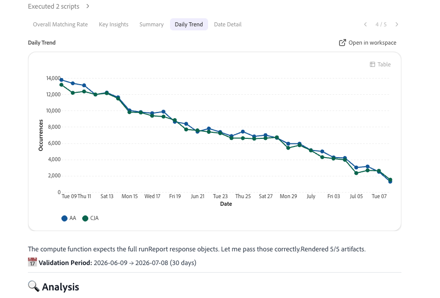

# Convalidare i dati con Collaboratore durante l’aggiornamento da Adobe Analytics a Customer Journey Analytics

>[!NOTE]
> 
>Segui i passaggi descritti in questa pagina solo dopo aver completato tutti i passaggi di aggiornamento precedenti. Puoi seguire i passaggi di aggiornamento consigliati (consigliati per la maggior parte delle organizzazioni), oppure puoi seguire i passaggi generati in modo dinamico per la tua organizzazione con la Guida all’aggiornamento di Customer Journey Analytics. <ul><li>**Passaggi di aggiornamento consigliati** (consigliati per la maggior parte delle organizzazioni)
Una serie di passaggi che conducono a un’implementazione ideale di Customer Journey Analytics.

Per informazioni dettagliate, vedere [Aggiornamento da Adobe Analytics a Customer Journey Analytics](https://experienceleague.adobe.com/it/docs/analytics-platform/using/compare-aa-cja/upgrade-to-cja/cja-upgrade-recommendations).
</li><li>**Guida all&#39;aggiornamento di Customer Journey Analytics** (passaggi personalizzati personalizzati in base alle esigenze specifiche della tua organizzazione)
È disponibile una nuova guida all’aggiornamento che genera in modo dinamico passaggi di aggiornamento personalizzati per la tua organizzazione e le tue circostanze specifiche.

Per accedere alla guida da Customer Journey Analytics, seleziona la scheda **[!UICONTROL Workspace]**, quindi seleziona **[!UICONTROL Aggiorna a Customer Journey Analytics]** nel pannello a sinistra. Seguire le istruzioni visualizzate.
</li></ul>

CX Enterprise Collaborator include un&#39;abilità di convalida che consente di convalidare i dati durante l&#39;aggiornamento da Adobe Analytics a Customer Journey Analytics. La convalida dei dati viene completata in un&#39;unica conversazione.

Questa abilità confronta automaticamente:

* Ogni dimensione, metrica e tendenza viene rilevata singolarmente nelle diverse implementazioni.

* Tutte le suite di rapporti di Adobe Analytics rispetto a tutte le visualizzazioni dati di Customer Journey Analytics.

Dopo aver effettuato questi confronti, l’abilità genera informazioni basate sull’intelligenza artificiale e consigli da implementare per facilitare l’aggiornamento a Customer Journey Analytics.

## Prima di iniziare

Per convalidare i dati come parte dell’aggiornamento, è necessario:

* La suite di rapporti di Adobe Analytics che desideri convalidare.

* La visualizzazione dati di Customer Journey Analytics che contiene gli stessi dati.

Non è necessario conoscere l’architettura della tua implementazione. L’abilità rileva automaticamente se l’implementazione di Customer Journey Analytics utilizza il connettore Source di Analytics o una nuova implementazione di Experience Platform Web SDK.

## Avviare una sessione di convalida

1. Accedi a Collaboratore.

1. Seleziona [!UICONTROL **Nuova chat**].

1. Nel campo di testo, richiedi all’agente di convalidare l’aggiornamento da Adobe Analytics a Customer Journey Analytics:

   **Chiedi conferma**

   > Aiutami a convalidare l’aggiornamento della mia azienda da Adobe Analytics a Customer Journey Analytics.

   La richiesta viene indirizzata all’abilità di convalida dei dati, che avvia un processo di configurazione interattivo.

1. Il processo di configurazione include le domande riportate nella tabella seguente. Per ogni domanda, seleziona una risposta, quindi seleziona [!UICONTROL **Invia**].

   >[!NOTE]
   >
   >Puoi modificare queste selezioni in un secondo momento nella stessa conversazione. Ad esempio, chiedi all’agente di modificare la suite di rapporti o la visualizzazione dati e l’agente ripete solo i passaggi necessari per aggiornare la selezione, senza riavviare l’intero processo di configurazione.

   | Domanda | Contesto aggiuntivo |
   |---------|----------|
   | [!UICONTROL **Seleziona la tua società Analytics**] | Questa è la società di accesso di Adobe Analytics. |
   | [!UICONTROL **Seleziona la suite di rapporti**] <!--In the UI, recommend change to "Select your Adobe Analytics report suite"--> | Questa è la suite di rapporti di Adobe Analytics che contiene i dati da convalidare in base ai dati di Customer Journey Analytics. |
   | [!UICONTROL **Seleziona la visualizzazione dati di Customer Journey Analytics**] | Questa è la visualizzazione dati in Customer Journey Analytics che contiene gli stessi dati della suite di rapporti di Adobe Analytics selezionata. |

1. Rivedi il riepilogo dell’installazione per confermare che stai convalidando i dati corretti prima di continuare. Il riepilogo include la società, la suite di rapporti e la visualizzazione dati selezionate, insieme a un’anteprima delle metriche e delle dimensioni principali in ciascun sistema.

1. Continua con la seguente sezione, [Scegli i dati da convalidare](#choose-the-data-to-validate).

## Scegli i dati da convalidare

Puoi convalidare singole metriche o dimensioni, oppure tutte le metriche e dimensioni incluse nella suite di rapporti e nella visualizzazione dati.

1. Selezionare una delle opzioni seguenti:

   | Opzione di convalida | Descrizione |
   |---------|----------|
   | [!UICONTROL **Confronto metrica singolo**] | Confronta la tendenza di una metrica tra Adobe Analytics e Customer Journey Analytics. Utilizzalo quando desideri un controllo rapido su una metrica specifica, ad esempio visualizzazioni di pagina o visite. |
   | [!UICONTROL **Confronto di una singola dimensione**] | Confronta il raggruppamento di una singola dimensione tra Adobe Analytics e Customer Journey Analytics. Utilizza questa opzione quando sospetti una differenza di mappatura o classificazione per una dimensione specifica. |
   | [!UICONTROL **Audit completo suite di rapporti e visualizzazione dati**] | Confronta fino a 40 metriche di Adobe Analytics e 20 dimensioni con le controparti Customer Journey Analytics in una singola esecuzione. Utilizzalo quando desideri una visualizzazione completa dello stato complessivo dell’aggiornamento. |

1. Continua con la seguente sezione, [Rivedi l&#39;analisi](#review-the-analysis).

## Rivedi l’analisi

1. Seleziona la scheda [!UICONTROL **Tasso di corrispondenza complessivo**] per visualizzare una percentuale che indica quanto i dati della suite di rapporti di Adobe Analytics corrispondono a quelli della visualizzazione dati di Customer Journey Analytics. Questo punteggio viene sempre visualizzato per primo, prima di qualsiasi altro risultato. Pesa tutte le metriche e le dimensioni confrontate in modo uniforme per garantire che le metriche a volume elevato, come le visualizzazioni di pagina, non distorcano il punteggio.

   Utilizza la seguente scala per interpretare il punteggio:

   | Punteggio | Valutazione | Che cosa significa |
   |---------|----------|----------|
   | 97% - 100% |  [!UICONTROL Eccellente] | Tutte le proprietà sono altamente allineate. Non è richiesta alcuna azione. |
   | 90%-96% |  [!UICONTROL Buono] | Sono presenti lacune minori. Monitora le tendenze e indaga se declinano. |
   | 75%-89% |  [!UICONTROL Revisione] | Esistono delle lacune significative. Analizza le cause principali prima di affidarti ai dati di Customer Journey Analytics. |
   | Inferiore al 75% |  [!UICONTROL Scadente] | Disallineamento significativo. Agisci immediatamente prima di utilizzare i dati di Customer Journey Analytics. |

1. Selezionare la scheda [!UICONTROL **Informazioni chiave**] per visualizzare due o quattro callout brevi, ognuno dei quali riepiloga un risultato dell&#39;analisi in una singola frase. I callout sono codificati in base al colore in base alla gravità, in modo da poter individuare prima i risultati più importanti.

1. Selezionare la scheda [!UICONTROL **Riepilogo**] per visualizzare i totali di Adobe Analytics, i totali di Customer Journey Analytics, la varianza totale, i giorni trascorsi e i giorni critici, in cui i giorni trascorsi e i giorni critici riflettono quanti giorni nell&#39;intervallo di date rientrano negli stati di varianza [!UICONTROL **Passaggio**] e [!UICONTROL **Critico**] descritti di seguito.

1. (Condizionale) Quando si esegue un confronto di una singola dimensione o di una singola metrica, è possibile visualizzare un confronto affiancato dei dati di Adobe Analytics e di Customer Journey Analytics nella scheda [!UICONTROL **Tendenza giornaliera**].

   Per le metriche, si tratta di un grafico a linee che confronta la tendenza giornaliera.

   

   Per le dimensioni, si tratta di un grafico a barre che confronta i valori principali.

   

1. (Condizionale) Quando si esegue un confronto di una singola dimensione o di una singola metrica, è possibile visualizzare i dettagli a livello di riga nella scheda [!UICONTROL **Dettagli data**]. Questa tabella elenca la data, il valore di Adobe Analytics, il valore di Customer Journey Analytics, la percentuale di varianza e un badge di stato per ogni metrica o valore di dimensione confrontato.

   

   Le colonne di scostamento e stato utilizzano la seguente scala:

   | Varianza | Stato | Che cosa significa |
   |---------|----------|----------|
   | Inferiore al 3% |  [!UICONTROL Passaggio] | I dati sono ben allineati. Non è richiesta alcuna azione. |
   | 3%-10% |  [!UICONTROL Contrassegno] | Monitora la differenza e indaga se continua o peggiora. |
   | Superiore al 10% |  [!UICONTROL Critico] | Indagate immediatamente. In genere si tratta di un problema di schema, acquisizione o mappatura. |

1. (Facoltativo) Quando si esegue una suite di rapporti completa e un controllo di visualizzazione dati, le schede [!UICONTROL **Tendenza giornaliera**] e [!UICONTROL **Dettagli giornalieri**] vengono sostituite da una scorecard che mostra i conteggi di superamento, con flag e critici, insieme a tabelle separate che elencano le prime cinque metriche e dimensioni con corrispondenza migliore e le prime cinque con corrispondenza minore.

1. Scorri verso il basso nell’analisi per visualizzare altri pattern e problemi rilevati durante l’analisi, le probabili cause di tali pattern e le azioni suggerite da intraprendere per risolvere eventuali discrepanze di dati.

   >[!NOTE]
   >
   >È prevista una varianza che non indica un problema con l’aggiornamento a Customer Journey Analytics.

   I problemi comuni includono:

   * Adobe Analytics conta i visitatori basati su dispositivo, mentre Customer Journey Analytics conta le persone, utilizzando l’unione di identità tra dispositivi diversi.
   * Adobe Analytics elabora i dati al momento della raccolta, mentre Customer Journey Analytics elabora i dati al momento del rapporto.
   * Le definizioni delle sessioni sono diverse: le visite di Adobe Analytics utilizzano un timeout fisso, mentre le sessioni di Customer Journey Analytics sono configurabili.
   * Adobe Analytics filtra i bot per impostazione predefinita, mentre il filtro bot di Customer Journey Analytics è opt-in.
   * Adobe Analytics riporta i valori mancanti come &quot;Non specificato&quot; o &quot;Nessuno&quot;, mentre Customer Journey Analytics li riporta come &quot;Nessun valore&quot;.
   * Le differenze del canale di marketing possono derivare dalle regole di elaborazione di Adobe Analytics rispetto ai campi derivati da Customer Journey Analytics applicati retroattivamente.
   * Se i valori di Customer Journey Analytics sono costantemente circa il doppio dei valori di Adobe Analytics in tutte le metriche, in genere questi indicano dati duplicati nella visualizzazione dati, anziché un effetto di unione delle identità.

1. Verifica che le azioni suggerite siano valide, quindi risolvile in Adobe Experience Platform o Adobe Analytics.

1. (Facoltativo) Continuare l&#39;analisi analizzando un&#39;altra metrica, analizzando un&#39;altra dimensione o eseguendo un altro rapporto con un massimo di 40 metriche e 20 dimensioni, come descritto in [Scegliere i dati da convalidare](#choose-the-data-to-validate). Non è necessario ripetere il processo di configurazione per eseguire questa operazione; le selezioni effettuate per la tua azienda, suite di rapporti e visualizzazione dati vengono riportate nel corso della conversazione.

1. Continuare a seguire i [passaggi consigliati](https://experienceleague.adobe.com/it/docs/analytics-platform/using/compare-aa-cja/upgrade-to-cja/cja-upgrade-recommendations#recommended-upgrade-steps-for-most-organizations) per l&#39;aggiornamento o i passaggi generati dinamicamente nella Guida all&#39;aggiornamento di Customer Journey Analytics. Per accedere alla guida da Customer Journey Analytics, seleziona la scheda **[!UICONTROL Workspace]**, quindi seleziona **[!UICONTROL Aggiorna a Customer Journey Analytics]** nel pannello a sinistra. Seguire le istruzioni visualizzate.

