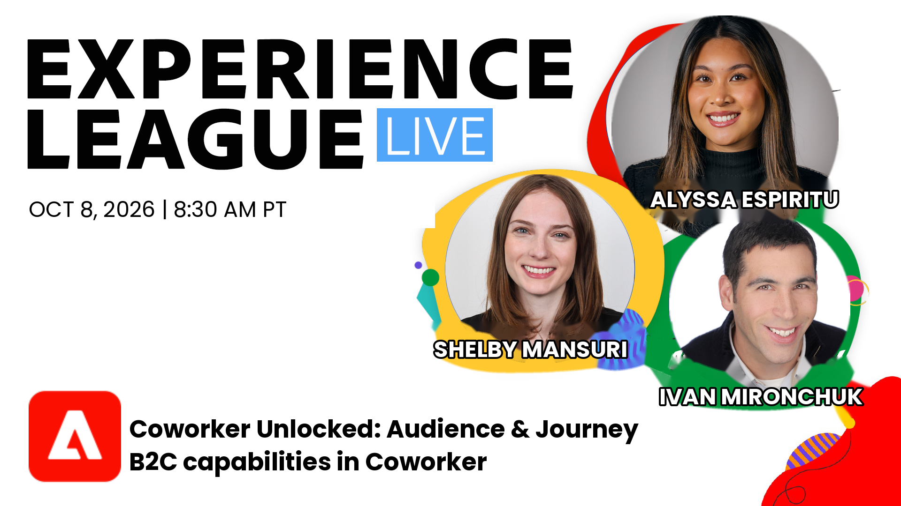

# Panoramica di CX Enterprise Coworker {#overview}

Coworker è un compagno di squadra basato sull’intelligenza artificiale che reimmagina la natura del lavoro per organizzazioni, team e singoli utenti. Cooworker automatizza elegantemente l’esperienza del cliente e i flussi di lavoro di marketing, consentendo alle organizzazioni di concentrarsi sul raggiungimento dei propri obiettivi aziendali e sulla trasformazione dei risultati, non sul coordinamento delle attività. In qualità di motore agentico, Coworker adotta un nuovo approccio innovativo per automatizzare i processi aziendali. Migliora le prestazioni e l’accuratezza del modello di intelligenza artificiale combinando dati, intelligenza, collaborazione e l’esecuzione di competenze agentiche con il contesto aziendale, la governance e la supervisione umana integrati.

## Chat collaboratore

Chat con i collaboratori consente ai team di automatizzare le attività dei prodotti Adobe utilizzando il linguaggio naturale, trasformando rapidamente le idee in azioni con una pianificazione flessibile, competenze personalizzabili ed esecuzione intelligente.

## Nozioni di base sulla chat per collaboratori

Che tu stia iniziando o desideri approfondire le tue competenze, queste playlist offrono un’introduzione guidata alla chat di CX Enterprise Coworker. Scopri come navigare tra le funzioni chiave, creare prompt efficaci e vedere esempi pratici di come Coworker aiuta i team a lavorare in modo più efficiente tra i prodotti Adobe Experience Cloud.

<!--
CARDS
* https://experienceleague.adobe.com/en/playlists/coworker-get-started-with-chat
   {title = Get started with CX Enterprise Coworker Chat}
   {description = Learn the value of CX Enterprise Coworker Chat and start executing use cases.}
   {cta = Watch}
   {image = https://video.tv.adobe.com/v/3498558?format=jpeg}    
*  https://experienceleague.adobe.com/en/playlists/coworker-customize-chat
    {title = Customize CX Enterprise Coworker Chat}
    {description = Learn how Coworker can be customized with reusable skills, enterprise integrations, plugins, and memory to deliver context-aware, personalized, and business-specific AI experiences that fits how your team works.}
    {cta = Watch}
    {image = https://video.tv.adobe.com/v/3502323?format=jpeg}
-->
<!-- START CARDS HTML - DO NOT MODIFY BY HAND -->

    

        

            

                <figure class="image x-is-16by9">
                    
                </figure>
            

            

                

                    

                        <a href="https://experienceleague.adobe.com/en/playlists/coworker-get-started-with-chat" target="_blank" rel="referrer" title="Introduzione a CX Enterprise Coworker Chat">Introduzione a CX Enterprise Coworker Chat</a>
                    

                    
Scopri il valore di CX Enterprise Coworker Chat e inizia a eseguire casi d’uso.

                

                <a href="https://experienceleague.adobe.com/en/playlists/coworker-get-started-with-chat" target="_blank" rel="referrer" class="spectrum-Button spectrum-Button--outline spectrum-Button--primary spectrum-Button--sizeM" style="align-self: flex-start; margin-top: 1rem;">
                    Guarda
                </a>
            

        

    

    

        

            

                <figure class="image x-is-16by9">
                    
                </figure>
            

            

                

                    

                        <a href="https://experienceleague.adobe.com/en/playlists/coworker-customize-chat" target="_blank" rel="referrer" title="Personalizzare CX Enterprise Coworker Chat">Personalizza CX Enterprise Coworker Chat</a>
                    

                    
Scopri come personalizzare Coworker con competenze riutilizzabili, integrazioni Enterprise, plug-in e memoria per fornire esperienze di intelligenza artificiale personalizzate, in base al contesto e specifiche per l’azienda, in base al funzionamento del team.

                

                <a href="https://experienceleague.adobe.com/en/playlists/coworker-customize-chat" target="_blank" rel="referrer" class="spectrum-Button spectrum-Button--outline spectrum-Button--primary spectrum-Button--sizeM" style="align-self: flex-start; margin-top: 1rem;">
                    Guarda
                </a>
            

        

    

<!-- END CARDS HTML - DO NOT MODIFY BY HAND -->

## Experience League LIVE: serie sbloccata dal collega

Unisciti alla serie CX Enterprise Coworker Unlocked per scoprire come le organizzazioni utilizzano l’assistenza basata sull’intelligenza artificiale per semplificare il lavoro nell’esperienza del cliente. Ogni sessione esplora casi d’uso pratici, dimostrazioni in tempo reale e consigli degli esperti che consentono ai team di accelerare i flussi di lavoro, scoprire informazioni approfondite e automatizzare le attività tra le applicazioni Adobe Experience Cloud. Sfoglia gli episodi precedenti o registrati per i prossimi eventi per scoprire nuovi modi per aumentare la produttività e promuovere i risultati dell’esperienza del cliente.

<!--
CARDS
* https://experienceleague.adobe.com/en/on-demand-events/exl-live-episode-09-24-26
  {title = Transforming CX Workflows with Adobe CX Enterprise Coworker}
  {description = Explore real-world use cases that demonstrate how organizations can put Coworker to work to uncover insights, create audiences, optimize journeys, and deliver customer experiences faster and more efficiently.}
  {cta = Watch}
*  https://engage.adobe.com/ExpLeagueLive-261008.html?cid=cwkr-ovw-20261008
  {title = Audience and Journey B2C capabilities in Coworker}
  {description = See how Coworker can execute end-to-end workflows for customer experience orchestration, increasing productivity and simplifying otherwise technical or complex tasks.}
  {cta = Register}
-->
<!-- START CARDS HTML - DO NOT MODIFY BY HAND -->

    

        

            

                <figure class="image x-is-16by9">
                    
                </figure>
            

            

                

                    

                        <a href="https://experienceleague.adobe.com/en/on-demand-events/exl-live-episode-09-24-26" target="_blank" rel="referrer" title="Trasformazione dei flussi di lavoro CX con Adobe CX Enterprise Coworker">Trasformazione dei flussi di lavoro CX con Adobe CX Enterprise Coworker</a>
                    

                    
Esplora i casi d’uso reali che dimostrano come le organizzazioni possono mettere Collaborator al lavoro per scoprire informazioni approfondite, creare tipi di pubblico, ottimizzare i percorsi e fornire esperienze cliente in modo più rapido ed efficiente.

                

                <a href="https://experienceleague.adobe.com/en/on-demand-events/exl-live-episode-09-24-26" target="_blank" rel="referrer" class="spectrum-Button spectrum-Button--outline spectrum-Button--primary spectrum-Button--sizeM" style="align-self: flex-start; margin-top: 1rem;">
                    Guarda
                </a>
            

        

    

    

        

            

                <figure class="image x-is-16by9">
                    
                </figure>
            

            

                

                    

                        <a href="https://engage.adobe.com/ExpLeagueLive-261008.html?cid=cwkr-ovw-20261008" target="_blank" rel="referrer" title="Funzionalità B2C di pubblico e Percorso in Coworker">Funzionalità B2C di pubblico e Percorso in Collaborator</a>
                    

                    
Scopri come Coworker può eseguire flussi di lavoro end-to-end per l’orchestrazione dell’esperienza del cliente, aumentando la produttività e semplificando attività altrimenti tecniche o complesse.

                

                <a href="https://engage.adobe.com/ExpLeagueLive-261008.html?cid=cwkr-ovw-20261008" target="_blank" rel="referrer" class="spectrum-Button spectrum-Button--outline spectrum-Button--primary spectrum-Button--sizeM" style="align-self: flex-start; margin-top: 1rem;">
                    Registra
                </a>
            

        

    

<!-- END CARDS HTML - DO NOT MODIFY BY HAND -->

## Team di collaboratori (precedentemente Campaigns)

Coworker Teams è una funzione modellata che consente ai piccoli team agili di alzarsi in piedi ed eseguire campagne.

* [Panoramica](./campaigns/overview.md)
* [Creare una campagna e-mail](./campaigns/create-an-email-campaign.md)
* [Casi d’uso](./campaigns/use-cases.md)
* [Best practice per la richiesta di informazioni](./campaigns/prompting-best-practices.md)
* [Connetti a Marketo Engage](./campaigns/connectors/marketo.md)
* [Connetti a Hubspot](./campaigns/connectors/hubspot.md)

## Progetti (presto disponibili)

Coworker Projects è un’area di lavoro unificata che consente di automatizzare i flussi di lavoro di orchestrazione dell’esperienza del cliente end-to-end, consentendo ai team di coordinare attività, approvazioni ed esecuzione per gestire i risultati dalla strategia alla consegna.
